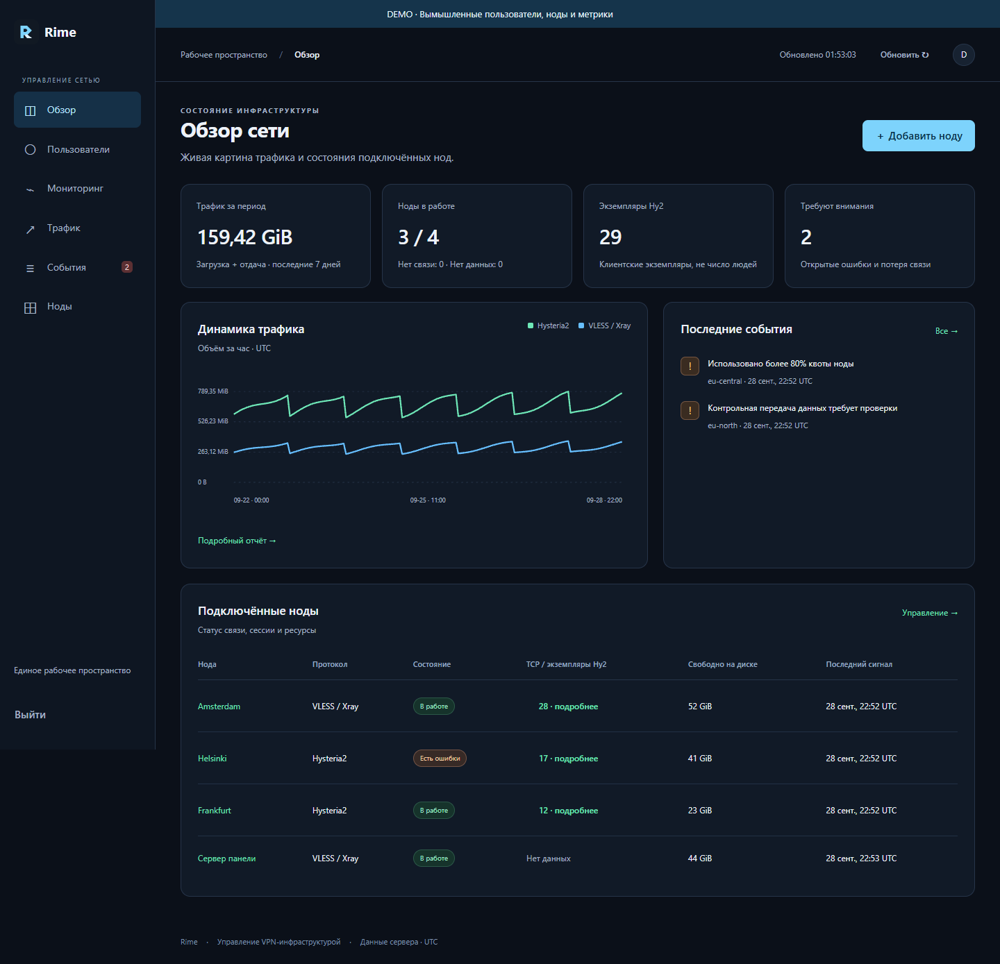
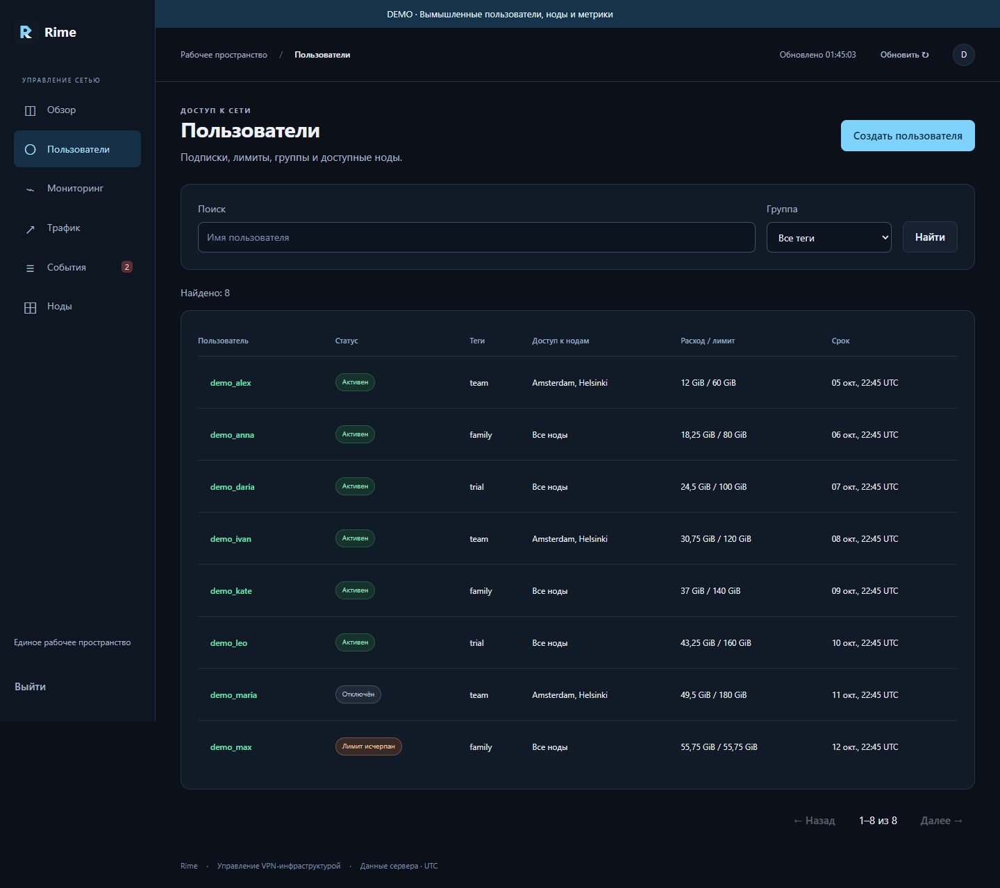
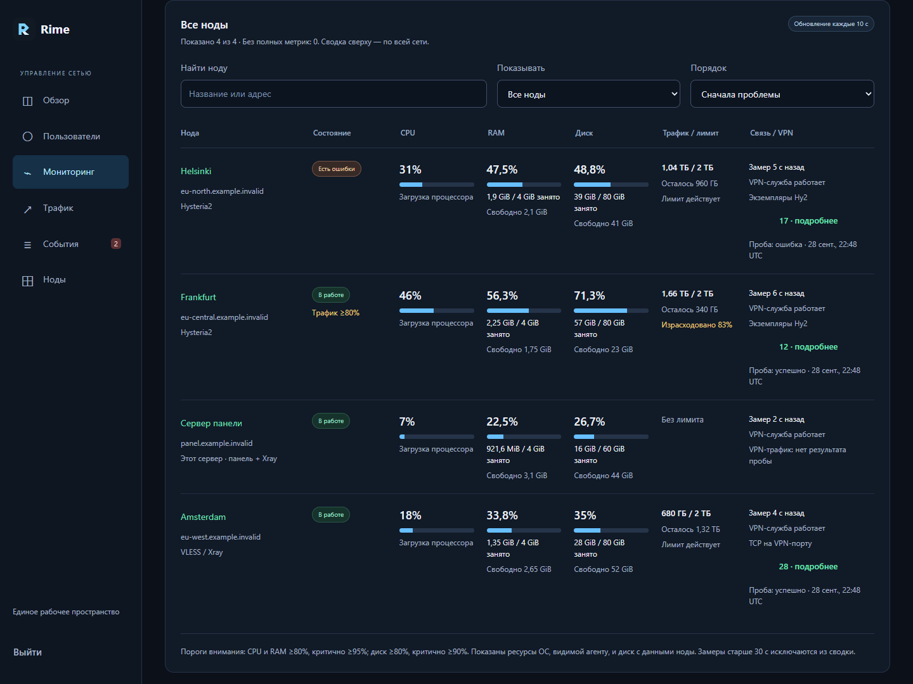
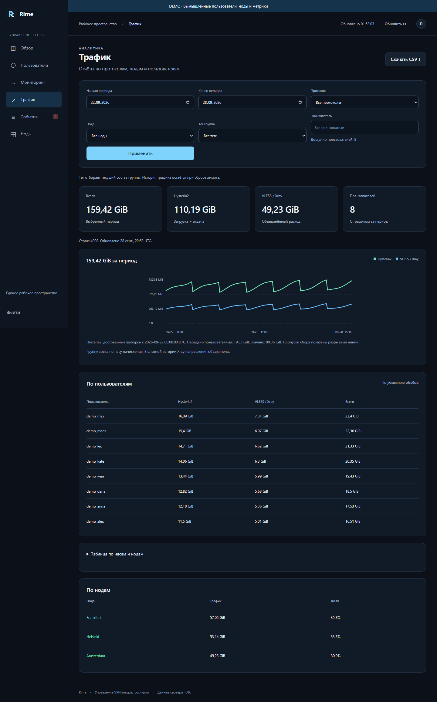
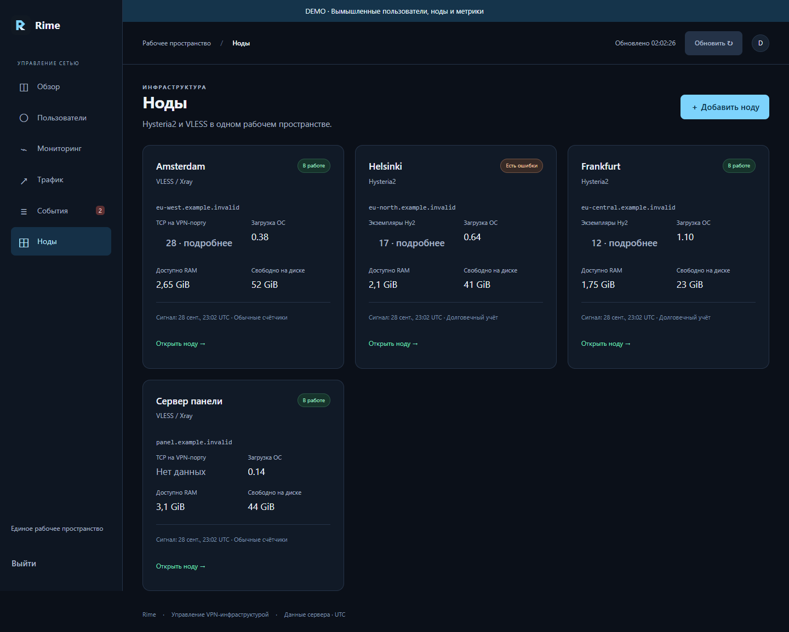
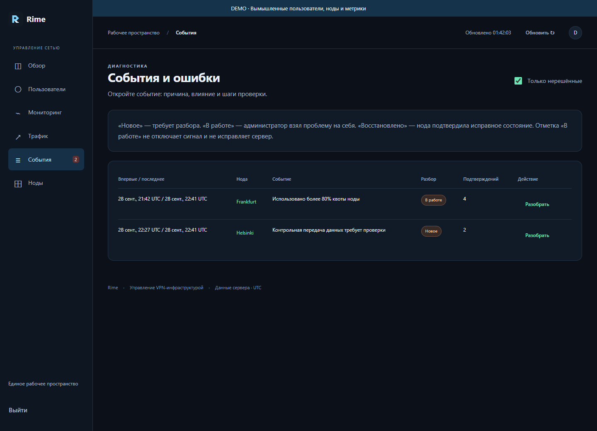
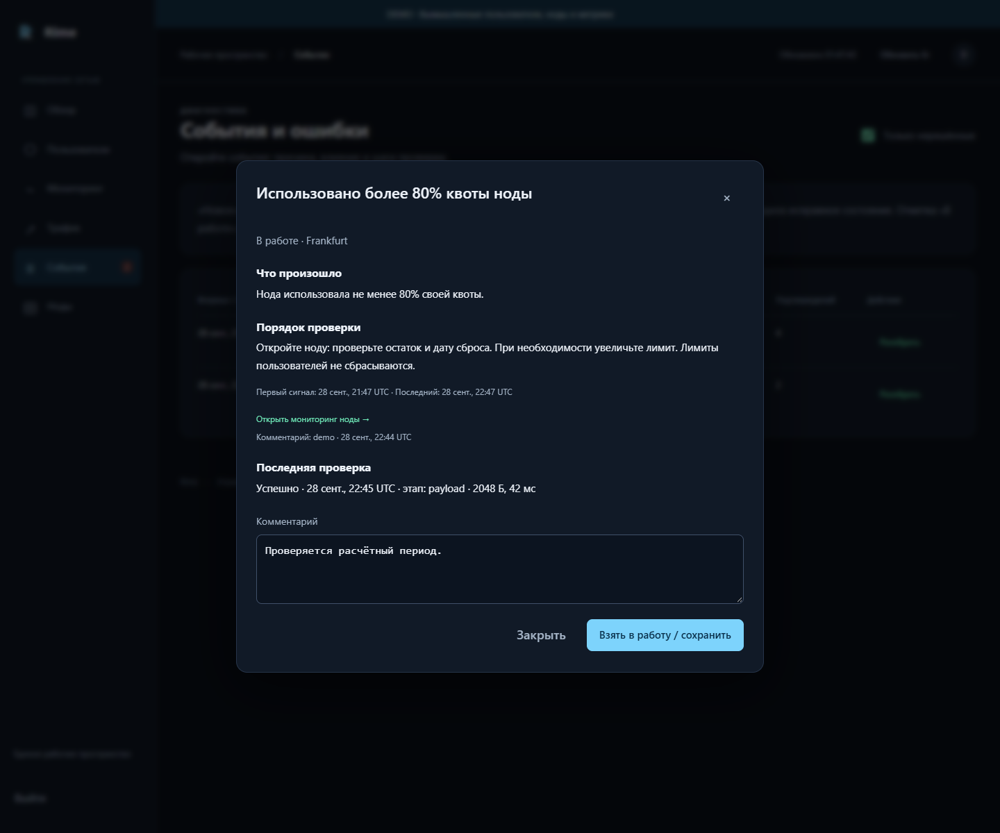

# Rime interface gallery

These are browser captures of the current `hy2bridge/web` interface. The API
responses come from `scripts/docs_demo.py`, a read-only, loopback-only fixture
server. Every account, domain, limit, connection count and metric is synthetic.
No production database, environment file, private key or subscription is loaded.
The example domains end in `.example.invalid` and cannot be real VPN endpoints.

## Overview



## Users, groups and access



## Resource monitoring



## Traffic reports



## Nodes



## Incidents





## Reproduce

```sh
python scripts/docs_demo.py --port 18808
```

Open `http://127.0.0.1:18808/fleet`. The demo login accepts `demo` / `demo` (or any
nonempty values); it creates no real session or account. Mutating API methods
are rejected. The helper does not start VPN services or make outbound requests.
Stop it with Ctrl+C after capturing. The fixture is for UI examples, not a
deployable panel or evidence of live network performance.

Capture the page content with a browser at 1440px width. For Monitoring, scroll
to the fleet table to show every server together. Keep the demonstration label
or the surrounding gallery caption. Check each output before publication for
real domains, usernames, tokens, IP addresses and workstation paths.
